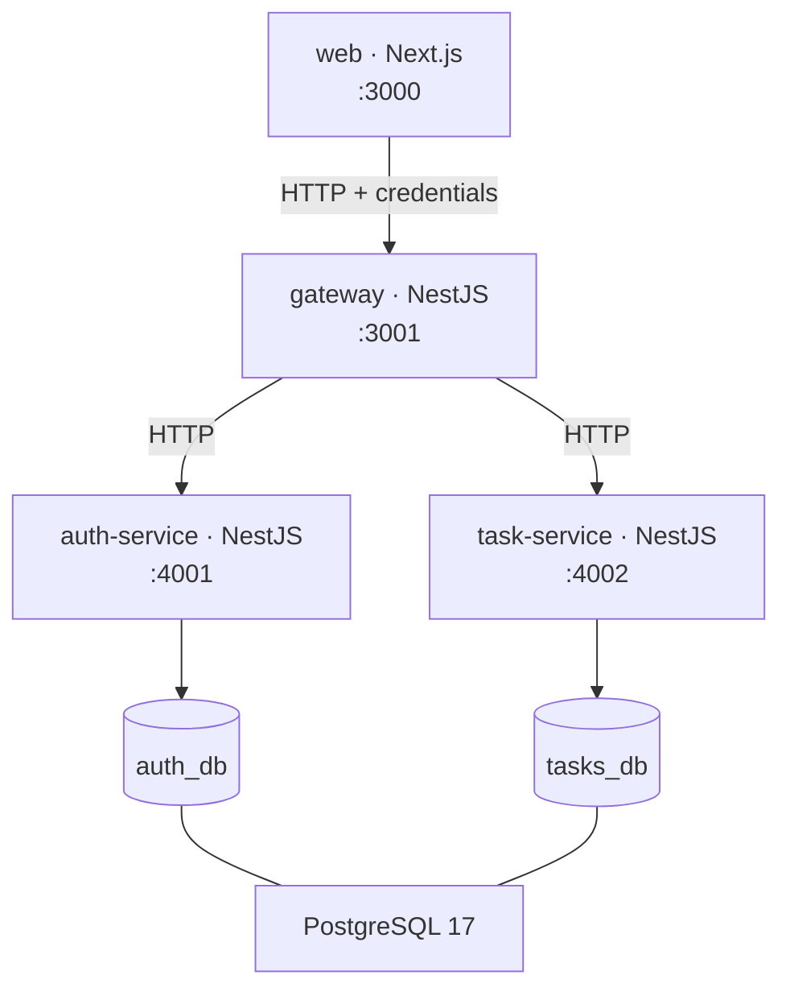

# Tally

A SaaS-style task manager — sign up, log in, and manage a personal task list with pagination, filtering, and sorting. Built as a microservice architecture: a Next.js frontend, an API gateway, and separate auth and task services, orchestrated with docker-compose.

> Written incrementally alongside the build. Sections fill in as each stage lands.

## Quick start

**Docker is the only prerequisite.** No Node, no pnpm, no PostgreSQL, and no `.env` step — every dependency is installed and every build runs inside the images.

```bash
git clone git@github.com:bkostic006-dev/TaskManager.git
cd TaskManager
docker compose up
```

Then open <http://localhost:3000>.

The first run builds four images including a production Next.js build, so expect a few minutes; subsequent starts take about 25 seconds. To reset everything, including the database:

```bash
docker compose down -v
```

Only the web app (`:3000`) and the gateway (`:3001`) are published. Compose puts the containers on two networks: `edge` carries the browser-facing traffic, while `internal` is marked `internal: true` and holds PostgreSQL and the two domain services. The gateway is the only container on both. So the frontend cannot address `auth-service`, `task-service` or the database at all — the service names do not even resolve from it — which makes "only accessible via the API Gateway" a property of the topology rather than a convention. Not publishing PostgreSQL also means a database already running on the host cannot collide with this one.

Ports are overridable if 3000 or 3001 are taken: `WEB_PORT=4000 GATEWAY_PORT=4001 docker compose up --build`. See `.env.example`.

## Architecture



The gateway is the only publicly reachable backend surface. It owns request validation, authentication guards, request logging, and exception filtering; the two services behind it hold domain logic and own their own database. Shared types cross service boundaries only through the `@tally/contracts` package — no service imports from another.

| Path                 | What                                               |
| -------------------- | -------------------------------------------------- |
| `apps/web`           | Next.js 15 · React 19 · Mantine 8 · TanStack Query |
| `apps/gateway`       | NestJS 11 — the public API surface                 |
| `apps/auth-service`  | NestJS 11 — users, JWTs, refresh-token rotation    |
| `apps/task-service`  | NestJS 11 — task CRUD, completion, pagination      |
| `packages/contracts` | Shared types, route constants, error codes         |

## Key design decisions and trade-offs

_(Written at the end of each stage, while the argument is fresh.)_

**HTTP as the service transport.** The brief allows HTTP, TCP, or gRPC. HTTP means status codes propagate naturally from a service to the gateway rather than being re-encoded, healthchecks are ordinary requests, and `HttpService` still returns Observables — so RxJS timeouts and retries come for free.

**Access token in memory, refresh token in an httpOnly cookie.** The 15-minute access token is returned in the response body and held only in JavaScript memory, so it is gone on reload and never sits in `localStorage` where any injected script could read it. The 7-day refresh token is an opaque 256-bit string in an httpOnly cookie scoped to `/auth` — unreadable from JavaScript, and never sent on task requests.

**argon2id for passwords, SHA-256 for refresh tokens.** Deliberately asymmetric. Passwords are low-entropy and guessable, so they get a slow memory-hard hash. A 256-bit random token has no brute-force surface worth defending, so a fast hash is the right tool — and it keeps refresh, the hottest auth path, cheap.

**Rotation is a compare-and-swap, not a read-then-write.** Every refresh revokes the presented token and issues a replacement. Two concurrent refreshes of the same token would both pass a separate "is it revoked?" check, so the revocation is a single `UPDATE ... WHERE revokedAt IS NULL AND expiresAt > now`, and the affected-row count is the caller's only proof it won. Verified under eight simultaneous refreshes: one `200`, seven `401`.

**One PostgreSQL container, two databases.** `auth_db` and `tasks_db` are owned by their respective services with no foreign key between them: `Task.userId` is a plain column, not a reference. This demonstrates the service boundary honestly while keeping the reviewer to a single container.

## Known limitations and future improvements

_(Collected as we go.)_

- **Building the web image needs network access to Google Fonts.** `next/font/google` downloads the two typefaces at build time and self-hosts them, so the running container never calls out — but `docker compose up` does, on the first build. Vendoring the `woff2` files and switching to `next/font/local` would remove the dependency entirely.
- **The gateway trusts itself.** Access tokens are verified at the gateway, which then passes `userId` to the services over the internal network. The services do not independently verify the caller. That is safe here because the `internal` network is unreachable from outside the gateway, but a production deployment would either verify the JWT in each service or require a signed internal credential.
- **Logging out is best-effort.** The refresh cookie is always cleared, but if the auth service cannot be reached the token is not revoked and stays valid until it expires. The browser cannot replay it; a copy taken beforehand could. Returning `503` was rejected because it reports something the user can neither act on nor retry — the failure is logged at `error` instead.
- **Access tokens cannot be revoked before they expire.** The gateway verifies them locally with no denylist, which is what keeps every request free of an auth-service round trip. A token stolen mid-session stays usable for up to 15 minutes. A `jti` denylist in a shared cache is the standard fix.
- **Reuse of a revoked refresh token returns `401` but does not revoke the rest of the chain.** The `replacedById` links are recorded, so revoking a whole lineage on reuse is a small addition — it is left out because a naive implementation logs users out on ordinary parallel refreshes.
- **HS256 with a shared secret.** Symmetric signing means every service that verifies a token could also mint one. RS256 with a published JWKS would let services verify without holding signing power.
