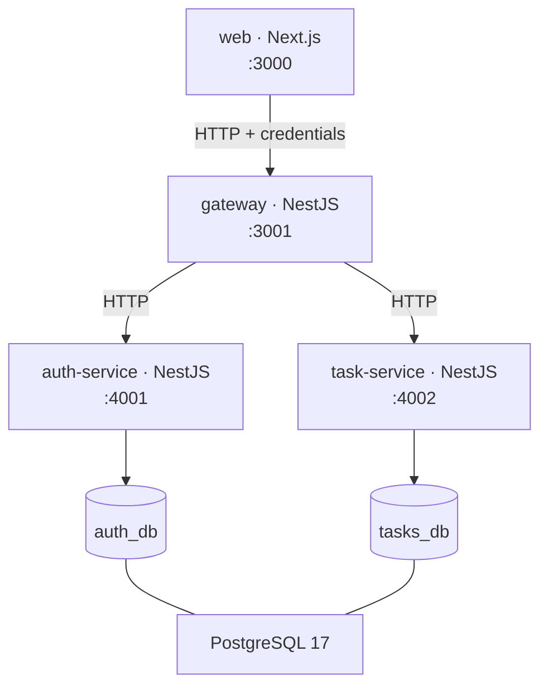

# Tally

A SaaS-style task manager — sign up, log in, and manage a personal task list with pagination, filtering, and sorting. Built as a microservice architecture: a Next.js frontend, an API gateway, and separate auth and task services, orchestrated with docker-compose.

## Quick start

**Docker is the only prerequisite.** No Node, no pnpm, no PostgreSQL, and no `.env` step — every dependency is installed and every build runs inside the images.

```bash
git clone git@github.com:bkostic006-dev/TaskManager.git
cd TaskManager
docker compose up
```

Then open <http://localhost:3000> and sign in with the seeded demo account:

| Email               | Password          |
| ------------------- | ----------------- |
| `dana@northbay.dev` | `tally-demo-2026` |

It comes with 47 tasks (16 done, 31 pending), which is enough to exercise pagination, filtering and sorting without creating anything first. Signing up for a fresh account works too — it just starts empty.

The first run builds four images including a production Next.js build, so expect a few minutes; subsequent starts take about 25 seconds. To reset everything, including the database:

```bash
docker compose down -v
```

Only the web app (`:3000`) and the gateway (`:3001`) are published. Compose puts the containers on two networks: `edge` carries the browser-facing traffic, while `internal` is marked `internal: true` and holds PostgreSQL and the two domain services. The gateway is the only container on both. So the frontend cannot address `auth-service`, `task-service` or the database at all — the service names do not even resolve from it — which makes "only accessible via the API Gateway" a property of the topology rather than a convention. Not publishing PostgreSQL also means a database already running on the host cannot collide with this one.

Ports are overridable if 3000 or 3001 are taken: `WEB_PORT=4000 GATEWAY_PORT=4001 docker compose up --build`. See `.env.example`.

## Architecture



The gateway is the only publicly reachable backend surface. It owns request validation, authentication guards, request logging, and exception filtering; the two services behind it hold domain logic and own their own database. Shared types cross service boundaries only through the `@tally/contracts` package — no service imports from another.

Over HTTP this can read as three web apps that happen to call each other, so it is worth naming where the separation is actually enforced: in `docker-compose.yml`, not in convention. `auth-service` and `task-service` declare no `ports:` block at all and sit only on the `internal` network, which is marked `internal: true`. Nothing outside that segment can route to them, and `web` is not on it — so "the task service is only accessible via the API Gateway" is a property of the topology, checkable by reading twelve lines of compose, rather than a rule the code is trusted to follow.

| Path                 | What                                               |
| -------------------- | -------------------------------------------------- |
| `apps/web`           | Next.js 15 · React 19 · Mantine 8 · TanStack Query |
| `apps/gateway`       | NestJS 11 — the public API surface                 |
| `apps/auth-service`  | NestJS 11 — users, JWTs, refresh-token rotation    |
| `apps/task-service`  | NestJS 11 — task CRUD, completion, pagination      |
| `packages/contracts` | Shared types, route constants, error codes         |

## API

Every route below is served by the gateway on `:3001`. "Auth" means a `Bearer` access token is required — the global `JwtAuthGuard` protects everything except the routes marked no.

| Method   | Path                    | Success | Auth | Notes                                                    |
| -------- | ----------------------- | ------- | ---- | -------------------------------------------------------- |
| `POST`   | `/auth/signup`          | `201`   | no   | Sets the refresh cookie; returns `{ accessToken, user }` |
| `POST`   | `/auth/login`           | `200`   | no   | Same body and cookie as signup                           |
| `POST`   | `/auth/refresh`         | `200`   | no   | Credential is the cookie, not a header; rotates it       |
| `POST`   | `/auth/logout`          | `204`   | no   | Always clears the cookie                                 |
| `GET`    | `/auth/me`              | `200`   | yes  | The account behind the presented token                   |
| `GET`    | `/tasks`                | `200`   | yes  | Paged, filtered, sorted — see below                      |
| `POST`   | `/tasks`                | `201`   | yes  |                                                          |
| `GET`    | `/tasks/:id`            | `200`   | yes  |                                                          |
| `PATCH`  | `/tasks/:id`            | `200`   | yes  | Title and description only                               |
| `DELETE` | `/tasks/:id`            | `204`   | yes  |                                                          |
| `PATCH`  | `/tasks/:id/complete`   | `200`   | yes  | Idempotent; does not re-stamp `completedAt`              |
| `PATCH`  | `/tasks/:id/uncomplete` | `200`   | yes  | Idempotent                                               |
| `GET`    | `/health`               | `200`   | no   | For the compose healthcheck                              |

Completion is a domain action rather than a field edit, which is why `/complete` and `/uncomplete` exist and `PATCH /tasks/:id` will not toggle `completed`.

**`GET /tasks` query parameters.** All optional; the task service supplies the defaults. An out-of-range value is a `400`, never silently clamped — a clamped `pageSize` would render "48 per page" over 8 rows and let the client conclude the user has 8 tasks.

| Parameter   | Values                                                          | Default     |
| ----------- | --------------------------------------------------------------- | ----------- |
| `page`      | integer ≥ 1                                                     | `1`         |
| `pageSize`  | `8` · `16` · `24` · `48`                                        | `8`         |
| `status`    | `all` · `completed` · `pending`                                 | `all`       |
| `search`    | ≤ 100 chars, case-insensitive contains on title and description | —           |
| `sortBy`    | `createdAt` · `completed` · `title`                             | `createdAt` |
| `sortOrder` | `asc` · `desc`                                                  | `desc`      |

It answers `{ data: Task[], meta: { page, pageSize, total, totalPages } }`.

**Errors** all share one shape from a single global exception filter: `{ statusCode, error, message, details? }`. `400` validation · `401` missing, expired or invalid token · `404` not found _or not yours_ · `409` email taken · `413` body over the gateway's JSON limit · `429` throttled · `500` unexpected · `503` an upstream service was unreachable or timed out.

## Key design decisions and trade-offs

**HTTP as the service transport.** The brief allows HTTP, TCP, or gRPC. HTTP means status codes propagate naturally from a service to the gateway rather than being re-encoded, healthchecks are ordinary requests, and `HttpService` still returns Observables — so RxJS timeouts and retries come for free.

**Access token in memory, refresh token in an httpOnly cookie.** The 15-minute access token is returned in the response body and held only in JavaScript memory, so it is gone on reload and never sits in `localStorage` where any injected script could read it. The 7-day refresh token is an opaque 256-bit string in an httpOnly cookie scoped to `/auth` — unreadable from JavaScript, and never sent on task requests.

**argon2id for passwords, SHA-256 for refresh tokens.** Deliberately asymmetric. Passwords are low-entropy and guessable, so they get a slow memory-hard hash. A 256-bit random token has no brute-force surface worth defending, so a fast hash is the right tool — and it keeps refresh, the hottest auth path, cheap.

**Rotation is a compare-and-swap, not a read-then-write.** Every refresh revokes the presented token and issues a replacement. Two concurrent refreshes of the same token would both pass a separate "is it revoked?" check, so the revocation is a single `UPDATE ... WHERE revokedAt IS NULL AND expiresAt > now`, and the affected-row count is the caller's only proof it won. Verified under eight simultaneous refreshes: one `200`, seven `401`.

**Rotation is also one transaction.** The revoke, the insert of the replacement, and the link between them commit together. Sequenced separately, any failure after the revoke — including the gateway abandoning the call at its three-second timeout while the service carries on — would destroy the user's only credential without delivering its replacement, logging them out with a `500` they cannot retry, because the token a retry would present is already dead. The compare-and-swap is unaffected: `updateMany`'s rowcount is still the verdict inside a transaction, since the losing caller blocks on the row lock and re-evaluates the predicate after the winner commits.

**The gateway accepts JSON and nothing else.** Nest registers a `urlencoded` body parser by default, and `application/x-www-form-urlencoded` is one of the content types a cross-origin `<form method="POST">` can send with no preflight. That made login CSRF possible: a page on any origin could post the attacker's credentials to `/auth/login`, and the victim's browser would store the resulting `Set-Cookie` — silently signing them into the attacker's account, where every task they then created would be readable by its owner. CORS does not help, because it hides the response the attacker never needed to read. The gateway boots with `bodyParser: false` and re-registers only `express.json()`, so such a request cannot be made without a preflight — and a preflight is something CORS can refuse.

**One PostgreSQL container, two databases.** `auth_db` and `tasks_db` are owned by their respective services with no foreign key between them: `Task.userId` is a plain column, not a reference. This demonstrates the service boundary honestly while keeping the reviewer to a single container.

## Known limitations and future improvements

- **Building the web image needs network access to Google Fonts.** `next/font/google` downloads the two typefaces at build time and self-hosts them, so the running container never calls out — but `docker compose up` does, on the first build. Vendoring the `woff2` files and switching to `next/font/local` would remove the dependency entirely.
- **The gateway trusts itself.** Access tokens are verified at the gateway, which then passes `userId` to the services over the internal network. The services do not independently verify the caller. That is safe here because the `internal` network is unreachable from outside the gateway, but a production deployment would either verify the JWT in each service or require a signed internal credential.
- **Logging out is best-effort.** The refresh cookie is always cleared, but if the auth service cannot be reached the token is not revoked and stays valid until it expires. The browser cannot replay it; a copy taken beforehand could. Returning `503` was rejected because it reports something the user can neither act on nor retry — the failure is logged at `error` instead.
- **Access tokens cannot be revoked before they expire.** The gateway verifies them locally with no denylist, which is what keeps every request free of an auth-service round trip. A token stolen mid-session stays usable for up to 15 minutes. A `jti` denylist in a shared cache is the standard fix.
- **Reuse of a revoked refresh token returns `401` but does not revoke the rest of the chain.** The `replacedById` links are recorded, so revoking a whole lineage on reuse is a small addition — it is left out because a naive implementation logs users out on ordinary parallel refreshes.
- **HS256 with a shared secret.** Symmetric signing means every service that verifies a token could also mint one. RS256 with a published JWKS would let services verify without holding signing power.
- **The shipped `JWT_SECRET` is a development-only placeholder.** `docker-compose.yml` falls back to a literal value that is committed to this repository, which is what makes `docker compose up` work with no `.env` step. While that value is in use, anyone holding a copy of the repo can forge an access token for any user id — including the demo account's, which is a published constant. Both backends log a warning at boot when they are started with it. Set `JWT_SECRET` (`openssl rand -base64 32`) for anything that is not a local demo. Keeping the zero-step boot was a deliberate trade for a reviewer-facing project; a real deployment would remove the fallback and let the container fail to start.
- **Signup is not enumeration-resistant, so login's timing defence is only half a defence.** `/auth/login` deliberately costs a full argon2 verification even for an unknown email, so response time cannot be used to discover which addresses have accounts. `/auth/signup` then answers `409` for an address that is taken, which discloses exactly the same fact directly. Closing it properly means always answering `201` and sending a "someone tried to register your address" email instead — real, and out of scope here. The login defence is still worth keeping (it is the endpoint an attacker scripts), but the API as a whole does not resist enumeration and this README would rather say so than imply otherwise.
