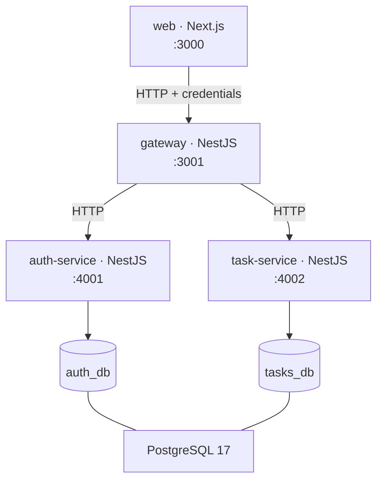

# Tally

A SaaS-style task manager — sign up, log in, and manage a personal task list with pagination, filtering, and sorting. Built as a microservice architecture: a Next.js frontend, an API gateway, and separate auth and task services, orchestrated with docker-compose.

> Written incrementally alongside the build. Sections fill in as each stage lands.

## Quick start

**Docker is the only prerequisite.** No Node, no pnpm, no PostgreSQL, and no `.env` step — every dependency is installed and every build runs inside the images.

```bash
git clone git@github.com:bkostic006-dev/TaskManager.git
cd TaskManager
docker compose up
```

Then open <http://localhost:3000>.

The first run builds four images including a production Next.js build, so expect a few minutes; subsequent starts take about 25 seconds. To reset everything, including the database:

```bash
docker compose down -v
```

Only the web app (`:3000`) and the gateway (`:3001`) are published. PostgreSQL and the two internal services are reachable only on the compose network — which is both the architecture the brief asks for and the reason a PostgreSQL already running on the host cannot collide with this one.

Ports are overridable if 3000 or 3001 are taken: `WEB_PORT=4000 GATEWAY_PORT=4001 docker compose up --build`. See `.env.example`.

## Architecture



The gateway is the only publicly reachable backend surface. It owns request validation, authentication guards, request logging, and exception filtering; the two services behind it hold domain logic and own their own database. Shared types cross service boundaries only through the `@tally/contracts` package — no service imports from another.

| Path                 | What                                                        |
| -------------------- | ----------------------------------------------------------- |
| `apps/web`           | Next.js 15 · React 19 · Mantine 8 · TanStack Query           |
| `apps/gateway`       | NestJS 11 — the public API surface                          |
| `apps/auth-service`  | NestJS 11 — users, JWTs, refresh-token rotation             |
| `apps/task-service`  | NestJS 11 — task CRUD, completion, pagination                |
| `packages/contracts` | Shared types, route constants, error codes                   |

## Key design decisions and trade-offs

_(Written at the end of each stage, while the argument is fresh.)_

**HTTP as the service transport.** The brief allows HTTP, TCP, or gRPC. HTTP means status codes propagate naturally from a service to the gateway rather than being re-encoded, healthchecks are ordinary requests, and `HttpService` still returns Observables — so RxJS timeouts and retries come for free.

**One PostgreSQL container, two databases.** `auth_db` and `tasks_db` are owned by their respective services with no foreign key between them: `Task.userId` is a plain column, not a reference. This demonstrates the service boundary honestly while keeping the reviewer to a single container.

## Known limitations and future improvements

_(Collected as we go.)_
